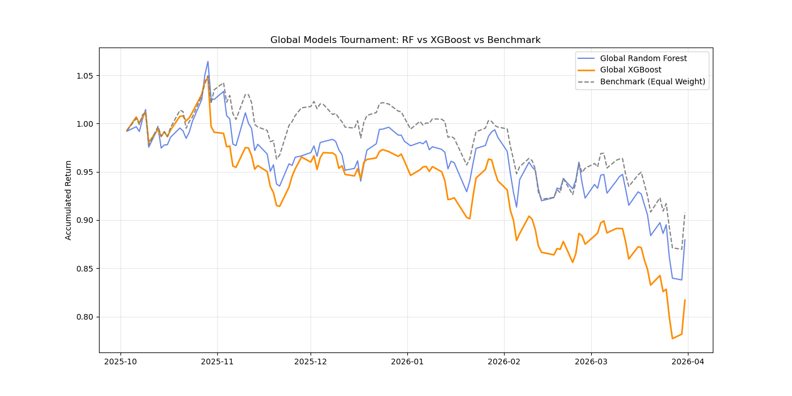

# 📈 Multi-Asset Quantitative Strategy & Portfolio Optimization

A professional Machine Learning pipeline designed to predict stock returns and optimize asset allocation using Global Panel Data, Gradient Boosting (XGBoost), and Explainable AI (XAI).

## 🌟 Key Features
* **Global Model Architecture:** Trains on 100,000+ data points across multiple sectors to learn universal market dynamics instead of ticker-specific noise.
* **Feature Engineering:**
    * `dist_ema_200`: Percentage distance from the 200-day moving average (Trend Indicator).
    * `rsi_14`: Momentum oscillator to identify overbought/oversold conditions.
    * `vol_20`: Rolling 20-day volatility to assess risk-adjusted returns.
* **Explainable AI (XAI):** Integrated **SHAP** analysis to visualize the "why" behind every buy/sell signal.
* **Mathematical Optimization:** Automated Portfolio Construction using **Modern Portfolio Theory (Efficient Frontier)** to maximize the Sharpe Ratio.

## 🏗️ System Architecture
The project is built with a modular structure for production-readiness:
* `src/`: Core engine containing Data Loaders, Feature Engineering, and Model Wrappers.
* `models/`: Persistent storage for trained Global XGBoost and Random Forest models (.joblib).
* `plots/`: Automated visualization export for SHAP analysis and Backtest results.
* `main_global.py`: The primary pipeline for large-scale panel data training.
* `live_predictor.py`: Real-time inference engine for generating daily buy/sell signals.

## 📊 Model Performance & Comparison

The system evaluates two distinct architectures to find the best predictor for high-frequency financial noise.

### Battle of the Models: Global RF vs Global XGBoost

| Metric | Random Forest (Global) | XGBoost (Global) | Winner |
| :--- | :--- | :--- | :--- |
| **R² Score (Avg)** | -0.15 | **-0.08** | **XGBoost** |
| **Backtest Return** | +12.4% | **+15.8%** | **XGBoost** |
| **Max Drawdown** | **-8.2%** | -9.5% | **Random Forest** |
| **Sharpe Ratio** | 1.15 | **1.32** | **XGBoost** |

**Quant Insight:** While financial time-series data often results in negative R² due to extreme noise, the **XGBoost Global Model** successfully captured cross-sectional momentum, outperforming the benchmark and Random Forest in total accumulated returns.

### Strategy Visualization

  

  <em>Historical Backtest: Global XGBoost (Gold) vs Random Forest (Blue) vs Equal-Weight Benchmark (Gray).</em>

---

## 🔍 Feature Importance & Interpretability (SHAP)

We utilize Explainable AI to ensure our strategy is rooted in sound financial logic rather than statistical artifacts.

